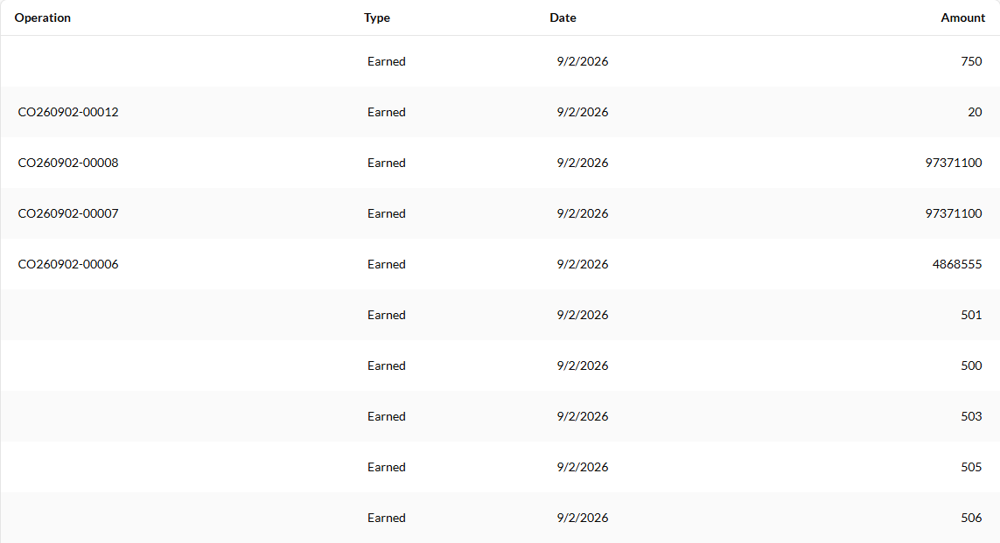

# Points History — "Operation" column is blank for every loyalty-mission reward row

## Status: CONFIRMED

**Environment:** vcst-qa (`TEST_ENV=vcst`) · Storefront theme **2.57.0** · `VirtoCommerce.Loyalty` **3.1006.0** · `VirtoCommerce.Xapi` **3.1020.0**
**Surface:** `{{FRONT_URL}}/account/points-history` (desktop table + mobile card)
**Severity:** Medium · **Reproducibility:** 100% (any account with a mission-granted points entry)
**Found:** 2026-09-08

## Summary

On the customer-facing **Points history** page, the **Operation** column renders **empty** for every
points entry granted by a **Loyalty Mission**. Order-driven entries render their order number
(`CO260902-00012`) correctly. The customer is shown an amount and a date with no indication of where
the points came from.

This is **not** a data problem: the underlying ledger row carries full attribution
(`objectType: "LoyaltyMissionProgress"`, `objectId: <mission-progress id>`). The xAPI resolver has no
`switch` case for that object type and returns `object: null`, and the storefront has no fallback
label, so the cell collapses to nothing.

**Scale on the fixture account:** 69 of 167 ledger entries (**41%**) are `LoyaltyMissionProgress` — all
of them render a blank Operation cell.

## Steps to Reproduce

1. Sign in to the storefront as an account that has at least one mission-granted points entry
   (fixture: `LOYALTY_VIP_USER`, `@td(LOYALTY_VIP_USER)`).
2. Navigate to `{{FRONT_URL}}/account/points-history`.
3. Inspect the **Operation** column across the first page of rows.

**Actual:** Rows whose points came from a mission show an **empty** Operation cell (amounts `750`,
`501`, `500`, `503`, `505`, `506` …). Rows whose points came from an order show `CO260902-…`.

**Expected:** Every row identifies its operation source — e.g. the mission's name, or at minimum a
localized label such as "Mission reward" — so the column is never blank for a row that has a known
source.

## Evidence



Rendered table (a11y snapshot, page 1) — blank first cell = mission grant:

| Operation | Type | Date | Amount |
|---|---|---|---|
| *(blank)* | Earned | 9/2/2026 | 750 |
| CO260902-00012 | Earned | 9/2/2026 | 20 |
| CO260902-00008 | Earned | 9/2/2026 | 97371100 |
| CO260902-00007 | Earned | 9/2/2026 | 97371100 |
| CO260902-00006 | Earned | 9/2/2026 | 4868555 |
| *(blank)* | Earned | 9/2/2026 | 501 |
| *(blank)* | Earned | 9/2/2026 | 500 |

**No console errors and no 4xx/5xx** — the page reports HTTP 200 throughout. This fails silently.

## Layer Validation

| Layer | Result | Evidence |
|-------|--------|----------|
| 1. Storefront Frontend | **FAIL** | Blank Operation cells; `GetLoyaltyPointsHistory` returns 200; screenshot above |
| 2. Backend Admin | N/A | No Admin SPA surface renders this column |
| 3. GraphQL xAPI | **FAIL** | `loyaltyPointsHistory` returns `object: null` for all 69 `LoyaltyMissionProgress` rows |
| 4. Platform REST API | **PASS** | `POST /api/loyalty-program-operation-log/search` returns `objectType: "LoyaltyMissionProgress"` + `objectId` on every one of those rows |

**Owning layer:** **Layer 3 — GraphQL xAPI.** Layer 4 has the attribution; Layer 3 drops it; Layer 1
inherits the loss.

Layer 3 vs Layer 4 for the same entry (`amount 750`, `2026-09-02T09:39:49Z`):

```
REST  -> { "amount":750, "operationType":"Earned",
           "objectType":"LoyaltyMissionProgress",
           "objectId":"e69c93d2ff8c4859853fe72a3e820061" }

xAPI  -> { "amount":750.0000, "operationType":"Earned", "object":null }
```

## Root Cause Analysis

**Primary — xAPI resolver has no case for `LoyaltyMissionProgress`.**
`vc-module-loyalty` — `src/VirtoCommerce.Loyalty.ExperienceApi/Extensions/DataLoaderContextAccessorExtensions.cs`,
`LoadLoyaltyObject()`:

```csharp
return objectType switch
{
    nameof(CustomerOrder)   => loader.LoadAsync(objectId),
    nameof(ApplicationUser) => ... new LoyaltyOperationLogObject { Type = "Registration" },
    _ => new DataLoaderResult<LoyaltyOperationLogObject>(Task.FromResult<LoyaltyOperationLogObject>(null))
};
```

`objectType` is `"LoyaltyMissionProgress"` for a mission grant, so it falls to the `_ =>` arm and the
`object` field resolves to **null**. Consumed by `Schemas/LoyaltyOperationLogType.cs` (the `object`
field's `FuncFieldResolver`).

**Secondary — the storefront has no fallback label.**
`vc-frontend` — `client-app/modules/loyalty/pages/points-history.vue`, `getOperation()`:

```ts
function getOperation(log: LoyaltyOperationLog) {
  if (log.object?.type === CUSTOMER_ORDER_OBJECT_TYPE) { return log.object.orderNumber; }
  if (log.object?.type == REGISTRATION_OBJECT_TYPE)    { return t("loyalty.points-history.registration"); }
  return log.object?.type;      // <- undefined when object is null -> renders as an empty cell
}
```

The fall-through returns `log.object?.type`, which is `undefined` for a null `object`; Vue renders that
as an empty string. The same helper backs the mobile `#mobile-item` card, so mobile is blank too.

**Consequence of fixing only Layer 3:** the cell would render the raw enum string
`LoyaltyMissionProgress`. A complete fix needs the resolver to return a populated object **and** the
storefront to map it to a localized label (ideally the mission's name — see *Related* below).

**Why the column was order-only:** the documented model is order-centric — *"This section shows the
number of points earned and redeemed **for each order**, as well as the total balance"*
([Points History](https://docs.virtocommerce.org/storefront/user-guide/account/points-history)). Loyalty
Missions introduced a second grant source that was never wired into this column. The docs make no
statement that a mission row should render blank, so this is a gap, not intended behaviour.

**SHA note:** source read at `dev`; the deployed artifact is `VirtoCommerce.Loyalty 3.1006.0`. The live
xAPI behaviour (`object: null` for every `LoyaltyMissionProgress` row) matches what the `dev` source
predicts, so the anchors hold — re-anchor line numbers when citing against the release tag.

## Related

- **BL-LOY-015** (per-entity attribution of a settlement) — this finding **narrows** it. That invariant
  records mission grants as "attributable to nothing" and the ledger's maximum discrimination as the
  amount. That measurement was taken against the **GraphQL** surface only; the Platform REST read here
  shows the record **does** carry `objectType` + `objectId` (one hop from the mission via the
  mission-progress id). The attribution gap is therefore a **read-side resolver omission**, not a
  write-side one — which makes BL-LOY-015 closable with a small resolver change rather than a schema
  redesign. Worth re-auditing via `/qa-review-oracles bl`; not edited here.
- Suite `083c` **MSNF-080** ("Points-history rows identify which mission granted them", BL-LOY-015)
  asserts exactly this behaviour and should fail against the current build.
- `project_loyalty_points_history_unsigned_by_design` — the **unsigned Redeemed amount** on this page is
  by design and is **not** part of this report.

## Fix Routing (→ /qa-fix)

- **Owning layer:** Layer 3 — xAPI
- **Suggested repo:** `VirtoCommerce/vc-module-loyalty`
- **repoKind:** module
- **Ownership hint:** platform
- **Component / module:** `VirtoCommerce.Loyalty.ExperienceApi` — loyalty points-history `object` resolver
- **RCA anchor:** `src/VirtoCommerce.Loyalty.ExperienceApi/Extensions/DataLoaderContextAccessorExtensions.cs` → `LoadLoyaltyObject()` `objectType switch` — add a `LoyaltyMissionProgress` arm (search symbol: `LoadLoyaltyObject`). Secondary, follow-on repo: `VirtoCommerce/vc-frontend` → `client-app/modules/loyalty/pages/points-history.vue` → `getOperation()`
- **Routing confidence:** HIGH for the owning layer and repo (Layer 4 PASS / Layer 3 FAIL is measured, and the missing `switch` arm is exact). Note for Gate 0: a *complete* customer-visible fix spans two repos — the resolver fix alone turns the blank cell into the raw string `LoyaltyMissionProgress`. Treat the `vc-frontend` label as a separate single-repo follow-up, not as a cross-repo fix.
